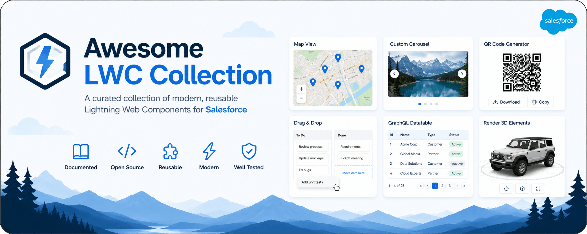
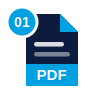

# ⚡️ Awesome LWC Collection


[](https://sonarcloud.io/summary/new_code?id=svierk_awesome-lwc-collection)
[](https://codecov.io/gh/svierk/awesome-lwc-collection)
[](https://app.fossa.com/projects/git%2Bgithub.com%2Fsvierk%2Fawesome-lwc-collection?ref=badge_shield)



## About the project

The repository should provide a collection of ready-to-use Lightning Web Components that might help your SFDX project and is intended to grow over time. Additionally, it also includes an initial configuration of Prettier, linting rules, git hooks and unit tests as well as useful VS Code settings. The setup really focuses on LWC development.

## Components available

Each component has a dedicated page - with a screenshot, a full attribute reference and usage examples - in the **component catalog**, built automatically from the component READMEs and grouped into the same categories used below. Every listed component ships with corresponding unit tests and docs.

<a href="https://svierk.github.io/awesome-lwc-collection/"></a>

### Data & Tables

<table>
  <tr>
    <th width="60"></th>
    <th align="left">Component</th>
    <th align="left">Description</th>
  </tr>
  <tr>
    <td align="center"></td>
    <td><a href="https://github.com/svierk/awesome-lwc-collection/tree/main/force-app/main/default/lwc/customDatatable">Custom Datatable</a></td>
    <td>A basic custom datatable with different configuration options.</td>
  </tr>
  <tr>
    <td align="center"></td>
    <td><a href="https://github.com/svierk/awesome-lwc-collection/tree/main/force-app/main/default/lwc/graphqlDatatable">GraphQL Datatable</a></td>
    <td>A custom datatable powered by the GraphQL wire adapter instead of Apex.</td>
  </tr>
  <tr>
    <td align="center"></td>
    <td><a href="https://github.com/svierk/awesome-lwc-collection/tree/main/force-app/main/default/lwc/csvToDatatable">CSV To Datatable</a></td>
    <td>A simple parser for UTF-8 encoded, comma separated .csv files.</td>
  </tr>
  <tr>
    <td align="center"></td>
    <td><a href="https://github.com/svierk/awesome-lwc-collection/tree/main/force-app/main/default/lwc/multiSelectCombobox">Multi Select Combobox</a></td>
    <td>Combobox with different configuration options that also supports multi select.</td>
  </tr>
</table>

### Files & Documents

<table>
  <tr>
    <th width="60"></th>
    <th align="left">Component</th>
    <th align="left">Description</th>
  </tr>
  <tr>
    <td align="center"></td>
    <td><a href="https://github.com/svierk/awesome-lwc-collection/tree/main/force-app/main/default/lwc/base64ToPdf">Base64 To PDF</a></td>
    <td>A simple utility for Base64 encoded strings to decode and download them as PDF file.</td>
  </tr>
  <tr>
    <td align="center"></td>
    <td><a href="https://github.com/svierk/awesome-lwc-collection/tree/main/force-app/main/default/lwc/contentDocumentTable">Content Document Table</a></td>
    <td>A generic table to show shared documents from a Salesforce Files library.</td>
  </tr>
  <tr>
    <td align="center"></td>
    <td><a href="https://github.com/svierk/awesome-lwc-collection/tree/main/force-app/main/default/lwc/visualforceToPdf">Visualforce To PDF</a></td>
    <td>A simple utility for displaying Visualforce based PDF documents.</td>
  </tr>
</table>

### Maps & Charts

<table>
  <tr>
    <th width="60"></th>
    <th align="left">Component</th>
    <th align="left">Description</th>
  </tr>
  <tr>
    <td align="center"></td>
    <td><a href="https://github.com/svierk/awesome-lwc-collection/tree/main/force-app/main/default/lwc/customMapView">Custom Map View</a></td>
    <td>Configurable map component for displaying locations via Google Maps API.</td>
  </tr>
  <tr>
    <td align="center"></td>
    <td><a href="https://github.com/svierk/awesome-lwc-collection/tree/main/force-app/main/default/lwc/graphqlMapView">GraphQL Map View</a></td>
    <td>Configurable map component for displaying locations via the GraphQL wire adapter.</td>
  </tr>
  <tr>
    <td align="center"></td>
    <td><a href="https://github.com/svierk/awesome-lwc-collection/tree/main/force-app/main/default/lwc/orgChartViewer">Org Chart Viewer</a></td>
    <td>An interactive organization chart with search, expand/collapse and PNG export, powered by d3-org-chart.</td>
  </tr>
  <tr>
    <td align="center"></td>
    <td><a href="https://github.com/svierk/awesome-lwc-collection/tree/main/force-app/main/default/lwc/render3DElementsThreeJS">Render 3D Elements</a></td>
    <td>A simple demo component for rendering 3D elements using Three.js.</td>
  </tr>
</table>

### Media & Input

<table>
  <tr>
    <th width="60"></th>
    <th align="left">Component</th>
    <th align="left">Description</th>
  </tr>
  <tr>
    <td align="center"></td>
    <td><a href="https://github.com/svierk/awesome-lwc-collection/tree/main/force-app/main/default/lwc/signaturePad">Signature Pad</a></td>
    <td>A canvas-based signature capture component with mouse and touch support.</td>
  </tr>
  <tr>
    <td align="center"></td>
    <td><a href="https://github.com/svierk/awesome-lwc-collection/tree/main/force-app/main/default/lwc/takeUserProfilePicture">Take User Profile Picture</a></td>
    <td>Lets Salesforce users take a new profile photo with their device's camera.</td>
  </tr>
  <tr>
    <td align="center"></td>
    <td><a href="https://github.com/svierk/awesome-lwc-collection/tree/main/force-app/main/default/lwc/qrCodeGenerator">QR Code Generator</a></td>
    <td>A basic QR Code Generator with optional logo overlay using the external QRCode.js library.</td>
  </tr>
  <tr>
    <td align="center"></td>
    <td><a href="https://github.com/svierk/awesome-lwc-collection/tree/main/force-app/main/default/lwc/customCarousel">Custom Carousel</a></td>
    <td>A simple custom carousel with different configuration options.</td>
  </tr>
  <tr>
    <td align="center"></td>
    <td><a href="https://github.com/svierk/awesome-lwc-collection/tree/main/force-app/main/default/lwc/dragAndDrop">Drag &amp; Drop Example</a></td>
    <td>An example showing the use of the HTML Drag and Drop API with LWC.</td>
  </tr>
</table>

### Fundamentals & Integration

<table>
  <tr>
    <th width="60"></th>
    <th align="left">Component</th>
    <th align="left">Description</th>
  </tr>
  <tr>
    <td align="center"></td>
    <td><a href="https://github.com/svierk/awesome-lwc-collection/tree/main/force-app/main/default/lwc/helloWorld">Hello World</a></td>
    <td>An example LWC that adds a classic greeting to any page.</td>
  </tr>
  <tr>
    <td align="center"></td>
    <td><a href="https://github.com/svierk/awesome-lwc-collection/tree/main/force-app/main/default/lwc/iFrame">iFrame</a></td>
    <td>A custom iFrame component with different configuration options.</td>
  </tr>
  <tr>
    <td align="center"></td>
    <td><a href="https://github.com/svierk/awesome-lwc-collection/tree/main/force-app/main/default/lwc/openRecordPageFlowAction">Open Record Page Flow Action</a></td>
    <td>Component to forward to a record page from flow.</td>
  </tr>
</table>

You can also find many more useful and reusable Lightning Web Components in the official [lwc-recipes](https://github.com/trailheadapps/lwc-recipes).

## Prerequisites

To use this library and try out the components in one of your orgs or locally, the [Node](https://nodejs.org/en/) version specified in the _package.json_ and the latest version of the [Salesforce CLI](https://developer.salesforce.com/tools/sfdxcli) should already be installed.

## Getting started

### Install all dependencies

To get everything up and runnning, you need to open the repository with VS Code, install all the recommended extensions and run the following command to install all required dependencies:

```
npm install
```

### Authorize an org

You need to authorize an org before you can push the components or use the local development server. Even for trying the components locally this is necessary because all data requests using Lightning Data Service or Apex will get proxied to the Salesforce org and returned in the local components. In VS Code the authorization can be done by pressing **Command + Shift + P**, enter "sfdx", and select **SFDX: Authorize an Org**.

Alternatively you can also run the following command from the command line:

```
sf org login web
```

### Deploy components to an org

To deploy all components of this project to the currently connected org execute:

```
sf project deploy start
```

### Local development

Local Dev for Lightning Web Components lets you create and modify components leveraging a real-time browser preview: [Preview Components with Local Dev](https://developer.salesforce.com/docs/platform/lwc/guide/get-started-test-components.html)

## Quality measures

### Git hooks

The project includes client-side pre-commit git hooks using [husky](https://github.com/typicode/husky) and [lint-staged](https://github.com/okonet/lint-staged). After installing all project dependencies, Prettier, Linter and unit tests are automatically executed before each commit.

### Prettier for code formatting

Run _Prettier_ to check all files for formatting issues:

```
npm run prettier
```

### Code linting with ESLint

Run _ESLint_ to check for linting issues:

```
npm run lint
```

### Unit tests with Jest

To execute all unit tests only once run:

```
npm run test:unit
```

To execute all unit tests in watch mode for development run:

```
npm run test:unit:watch
```

To execute all unit tests with generated code coverage run:

```
npm run test:unit:coverage
```

### Documentation with VitePress

The [component documentation site](https://svierk.github.io/awesome-lwc-collection/) is built with [VitePress](https://vitepress.dev/) directly from the individual component READMEs, so it stays in sync automatically and is redeployed to GitHub Pages on every change to `main`.

To preview the docs site locally with hot reload run:

```
npm run docs:dev
```

To build the static site (as it is published) run:

```
npm run docs:build
```

## Contributing

Contributions are welcome - whether it's a bug fix, an improvement or a brand-new component. Please read the [contributing guide](CONTRIBUTING.md) to get started and note the [code of conduct](https://github.com/svierk/awesome-lwc-collection?tab=coc-ov-file). Security issues should be reported privately as described in the [security policy](SECURITY.md).
