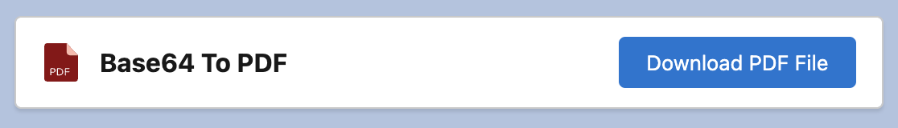

# Base64 To PDF

A simple utility for Base64 encoded strings to decode them into PDF files. How the component was built and works in detail is explained in the following Medium post: [How to display and download Base64 encoded PDF documents with Lightning Web Components](https://javascript.plainenglish.io/how-to-display-and-download-base64-encoded-pdf-documents-with-lightning-web-components-d4a10c7fa4c3)

## Attributes

| Name   | Type   | Default | Description                                                           |
| ------ | ------ | ------- | --------------------------------------------------------------------- |
| height | string | '500px' | Specifies the height of the pdf iframe. Default height is 500 pixels. |
| width  | string | '100%'  | Specifies the width of the pdf iframe. Default width is 100 percent.  |
