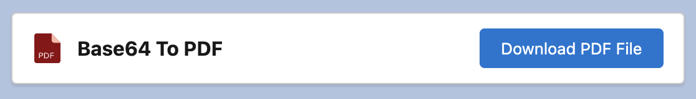

# Base64 To PDF

A simple utility for Base64 encoded strings to decode and download them as PDF file.

## Read on Medium

**[How to display and download Base64 encoded PDF documents with Lightning Web Components](https://javascript.plainenglish.io/how-to-display-and-download-base64-encoded-pdf-documents-with-lightning-web-components-d4a10c7fa4c3)**
