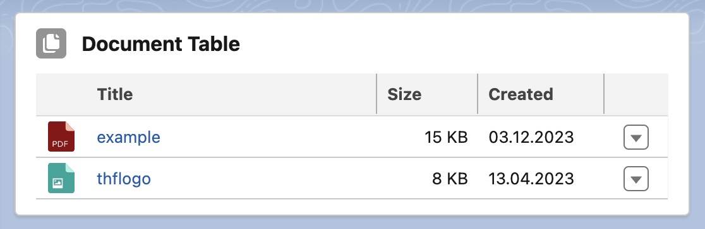

# Content Document Table

A generic table to show shared documents from a Salesforce Files library.

## Attributes

| Name                 | Type    | Default          | Description                                                                                                                                                                                                                                                      |
| -------------------- | ------- | ---------------- | ---------------------------------------------------------------------------------------------------------------------------------------------------------------------------------------------------------------------------------------------------------------- |
| card-icon            | string  | 'standard:file'  | If show card option is active, the card icon is displayed in the header before the card title. It should contain the SLDS name of the icon. Specify the name in the format 'standard:file' where 'standard' is the category and 'case' the icon to be displayed. |
| card-title           | string  | 'Document Table' | If show card option is active, the card title can include text and is displayed in the header above the table.                                                                                                                                                   |
| folder               | string  | null             | Folder name within Files library.                                                                                                                                                                                                                                |
| library              | string  | 'Documents'      | Files library name.                                                                                                                                                                                                                                              |
| record-id            | string  | null             | If the component is used on a lightning record page, the page sets the property to the id of the current record.                                                                                                                                                 |
| show-card            | boolean | false            | If present, the table is wrapped in a lightning card to fit better into the overall page layout.                                                                                                                                                                 |
| show-delete-action   | boolean | false            | If present, the last column contains a delete file action.                                                                                                                                                                                                       |
| show-download-action | boolean | false            | If present, the last column contains a download file action.                                                                                                                                                                                                     |
| show-view-action     | boolean | false            | If present, the last column contains a view file action.                                                                                                                                                                                                         |

## Component Dependencies

| Name                          | Type | Description                                                                                   |
| ----------------------------- | ---- | --------------------------------------------------------------------------------------------- |
| contentDocumentIcon           | LWC  | Custom datatable cell type to display the appropriate icon based on the file type.            |
| contentDocumentPreview        | LWC  | Custom datatable cell type that is used to display a file preview when clicking on the title. |
| contentDocumentTableExtension | LWC  | Custom extension of the standard LWC datatable to support individual table cell types.        |
| ContentDocumentController     | Apex | Controller class for retrieving content documents from files library.                         |
| ContentDocumentControllerTest | Apex | Test class for ContentDocumentController.                                                     |
