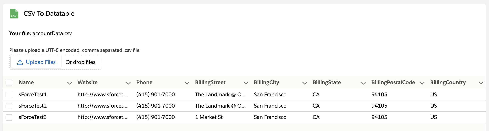

# CSV To Datatable

A simple parser for UTF-8 encoded, comma separated .csv files. How the component was built and works in detail is explained in the following Medium post: [How to Build a Simple CSV Parser with Lightning Web Components](https://javascript.plainenglish.io/how-to-build-a-simple-csv-parser-with-lightning-web-components-464a110a1cd2)

