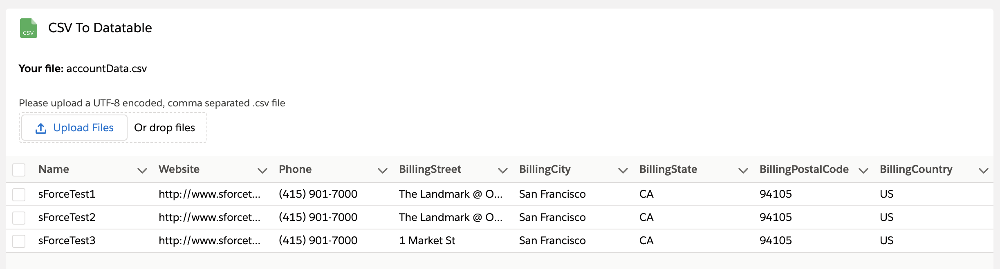

# CSV To Datatable

A simple parser for UTF-8 encoded, comma separated .csv files.

**Available in:** App Page · Home Page · Record Page



## Read on Medium

<a href="https://javascript.plainenglish.io/how-to-build-a-simple-csv-parser-with-lightning-web-components-464a110a1cd2">
  
</a>

**[How to Build a Simple CSV Parser with Lightning Web Components](https://javascript.plainenglish.io/how-to-build-a-simple-csv-parser-with-lightning-web-components-464a110a1cd2)**

## Usage

```html
<c-csv-to-datatable></c-csv-to-datatable>
```

The component is self-contained: after uploading a UTF-8 encoded, comma separated `.csv` file, the parsed rows are displayed in a datatable.
