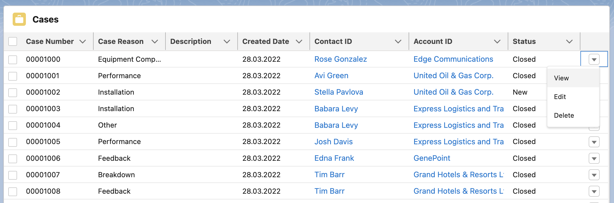

# Custom Datatable

A basic custom datatable with different configuration options.

## Attributes

| Name                    | Type    | Default | Description                                                                                                                                                                                                                                                    |
| ----------------------- | ------- | ------- | -------------------------------------------------------------------------------------------------------------------------------------------------------------------------------------------------------------------------------------------------------------- |
| card-icon               | string  | ''      | If show card option is active, the card icon is displayed in the header before the card title. It should contain the SLDS name of the icon. Specify the name in the format 'utility:down' where 'utility' is the category and 'down' the icon to be displayed. |
| cardTitle               | string  | ''      | If show card option is active, The card title can include text and is displayed in the header above the table.                                                                                                                                                 |
| column-widths-mode      | string  | 'fixed' | Specifies how column widths are calculated. Set to 'fixed' for columns with equal widths. Set to 'auto' for column widths that are based on the width of the column content and the table width.                                                               |
| default-sort-direction  | string  | 'asc'   | Specifies the default sorting direction on an unsorted column. Valid options include 'asc' and 'desc'.                                                                                                                                                         |
| field-set-api-name      | string  | ''      | API name of the field set that specifies which fields are displayed in the table.                                                                                                                                                                              |
| hide-checkbox-column    | boolean | false   | If present, the checkbox column for row selection is hidden.                                                                                                                                                                                                   |
| hide-table-header       | boolean | false   | If present, the table header is hidden.                                                                                                                                                                                                                        |
| is-used-as-related-list | boolean | false   | If present, the table is wrapped with the correct page header to fit better into the related list layout.                                                                                                                                                      |
| key-field               | string  | 'Id'    | Required field for better table performance. Associates each row with a unique Id.                                                                                                                                                                             |
| max-column-width        | number  | 1000    | The maximum width for all columns. The default is 1000px.                                                                                                                                                                                                      |
| max-row-selection       | number  | 50      | The maximum number of rows that can be selected. Checkboxes are used for selection by default, and radio buttons are used when maxRowSelection is 1.                                                                                                           |
| min-column-width        | number  | 50      | The minimum width for all columns. The default is 50px.                                                                                                                                                                                                        |
| object-api-name         | string  | ''      | API name of the object that will be displayed in the table.                                                                                                                                                                                                    |
| read-only               | boolean | false   | If present, then all datatable fields are not editable.                                                                                                                                                                                                        |
| resize-column-disabled  | boolean | false   | If present, column resizing is disabled.                                                                                                                                                                                                                       |
| row-number-offset       | number  | 0       | Determines where to start counting the row number.                                                                                                                                                                                                             |
| show-card               | boolean | false   | If present, the table is wrapped in a lightning card to fit better into the overall page layout.                                                                                                                                                               |
| show-delete-row-action  | boolean | false   | If present, the last column contains a delete record action.                                                                                                                                                                                                   |
| show-edit-row-action    | boolean | false   | If present, the last column contains a edit record action.                                                                                                                                                                                                     |
| show-row-number-column  | boolean | false   | If present, the row numbers are shown in the first column.                                                                                                                                                                                                     |
| show-view-row-action    | boolean | false   | If present, the last column contains a view record action.                                                                                                                                                                                                     |
| suppress-bottom-bar     | boolean | false   | If present, the footer that displays the Save and Cancel buttons is hidden during inline editing.                                                                                                                                                              |
| where-conditions        | string  | ''      | Optional where clause conditions for loaded data records.                                                                                                                                                                                                      |
