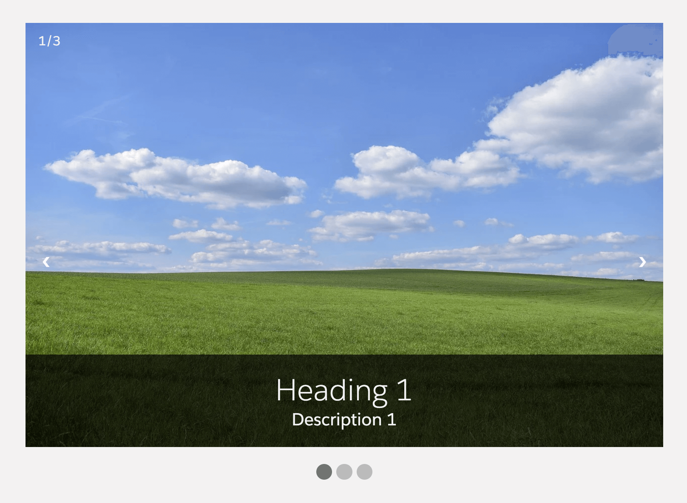

# Custom Slider

A simple custom slider with different configuration options.



## Attributes

| Name                    | Type    | Default | Description                                                                                                                            |
| ----------------------- | ------- | ------- | -------------------------------------------------------------------------------------------------------------------------------------- |
| auto-scroll             | boolean | false   | If present, automatic slide scrolling will be enabled.                                                                                 |
| custom-height           | string  | ''      | Set maximum height of the slider in percent or pixels.                                                                                 |
| custom-width            | string  | '600px' | Set maximum width of the slider in percent or pixels.                                                                                  |
| hide-navigation-buttons | boolean | false   | If present, the "next" and "prev" navigation buttons will be hidden.                                                                   |
| hide-navigation-dots    | boolean | false   | If present, the navigation dots below the slider will be hidden.                                                                       |
| hide-slide-number       | boolean | false   | If present, the current slide number will be hidden.                                                                                   |
| hide-slide-text         | boolean | false   | If present, the text overlay with heading and description will be hidden.                                                              |
| scroll-duration         | number  | 5000    | Set the duration in milliseconds after which the next slide should be displayed.                                                       |
| slides-data             | Array   |         | JSON array of slides that are displayed in the custom slider. Each slide has the following attributes: image, heading and description. |

### Example slides-data JSON array;

```
[
  {
    "image": "https://example.com/image1.jpg",
    "heading": "Slide 1",
    "description": "Description for slide 1"
  },
  {
    "image": "https://example.com/image2.jpg",
    "heading": "Slide 2",
    "description": "Description for slide 2"
  },
  {
    "image": "https://example.com/image3.jpg",
    "heading": "Slide 3",
    "description": "Description for slide 3"
  }
]
```
