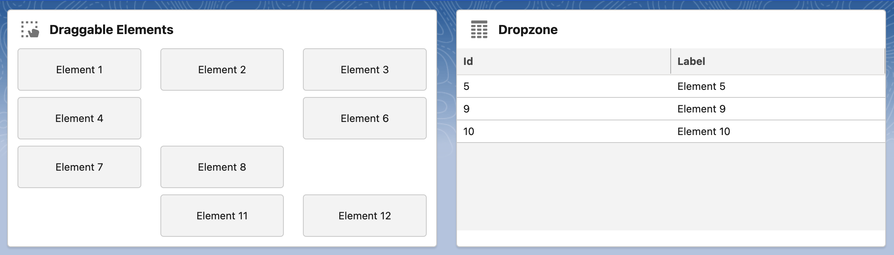

# Drag & Drop Example

An example showing the use of the HTML Drag and Drop API with LWC.

**Available in:** App Page · Home Page · Record Page



## Read on Medium

<a href="https://medium.com/javascript-in-plain-english/implement-drag-drop-with-lwc-2bb9ef7253d6">
  
</a>

**[Implement Drag & Drop with LWC](https://medium.com/javascript-in-plain-english/implement-drag-drop-with-lwc-2bb9ef7253d6)**

## Usage

```html
<c-drag-and-drop></c-drag-and-drop>
```

The example is self-contained: drag one of the demo elements into the dropzone card and it is added to the datatable. Use it as a starting point for your own drag & drop implementations.
