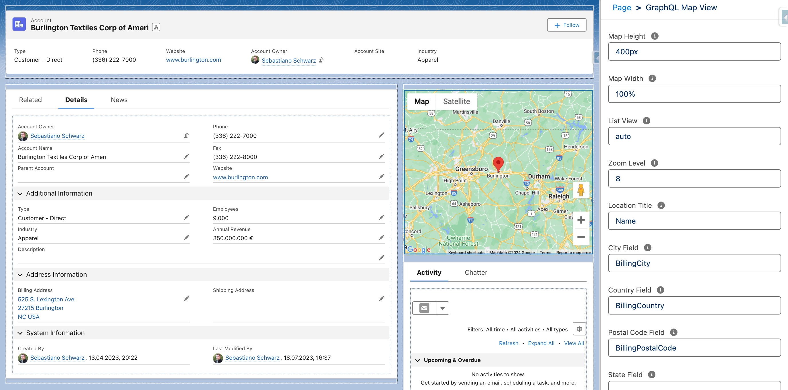

# GraphQL Map View

Configurable map component for displaying locations via Google Maps API using LWC GraphQL Wire Adapter.

## Attributes

| Name              | Type   | Default | Description                                                                                                                       |
| ----------------- | ------ | ------- | --------------------------------------------------------------------------------------------------------------------------------- |
| record-id         | string |         | If the component is used on a lightning record page, the page sets the property to the id of the current record.                  |
| object-api-name   | string |         | If the component is used on a lightning record page, the page sets the property to the API name of the current object.            |
| height            | string | '400px' | Height of the map component in percent or pixels. The default is 400px.                                                           |
| width             | string | '100%'  | Width of the map component in percent or pixels. The default is 100%.                                                             |
| list-view         | string | 'auto'  | Displays or hides the list of locations. Valid values are visible, hidden, or auto.                                               |
| zoom-level        | string |         | Supports zoom levels from 1 to 20. If not specified, the component calculates a zoom level to accommodate the markers in the map. |
| title-field       | string | 'Name'  | API name of the field that contains the location title. The default is the Name field.                                            |
| city-field        | string |         | API name of the field that contains the city.                                                                                     |
| country-field     | string |         | API name of the field that contains the country.                                                                                  |
| postal-code-field | string |         | API name of the field that contains the postal code.                                                                              |
| state-field       | string |         | API name of the field that contains the state.                                                                                    |
| street-field      | string |         | API name of the field that contains the street.                                                                                   |

## Component Dependencies

| Name                    | Type | Description                                                                      |
| ----------------------- | ---- | -------------------------------------------------------------------------------- |
| graphqlMapViewExtension | LWC  | Custom extension to support dynamically constructing GraphQL queries at runtime. |
