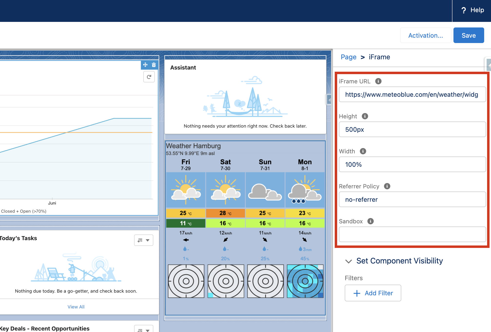

# iFrame

A custom iFrame component with different configuration options. How the component was built and works in detail is explained in the following Medium post: [How to Build a Reusable iFrame with Lightning Web Components](https://medium.com/javascript-in-plain-english/how-to-build-a-reusable-iframe-with-lightning-web-components-76a2ad27286)

## Attributes

| Name    | Type   | Default | Description                                                        |
| ------- | ------ | ------- | ------------------------------------------------------------------ |
| height  | string | '500px' | Specifies the height of the iframe. Default height is 500 pixels.  |
| sandbox | string | ''      | Enables an extra set of restrictions for the content in an iframe. |
| url     | string | ''      | Specifies the address of the document to embed in the iframe.      |
| width   | string | '100%'  | Specifies the width of an iframe. Default width is 100 percent.    |
