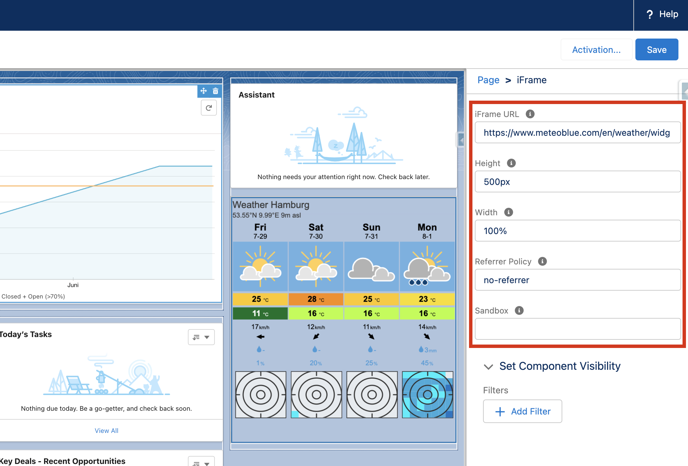

# iFrame

A custom iFrame component with different configuration options.

**Available in:** App Page · Home Page · Record Page · Flow Screen



## Read on Medium

<a href="https://medium.com/javascript-in-plain-english/how-to-build-a-reusable-iframe-with-lightning-web-components-76a2ad27286">
  
</a>

**[How to Build a Reusable iFrame with Lightning Web Components](https://medium.com/javascript-in-plain-english/how-to-build-a-reusable-iframe-with-lightning-web-components-76a2ad27286)**

## Attributes

| Name    | Type   | Default | Description                                                        |
| ------- | ------ | ------- | ------------------------------------------------------------------ |
| height  | string | '500px' | Specifies the height of the iframe. Default height is 500 pixels.  |
| sandbox | string | ''      | Enables an extra set of restrictions for the content in an iframe. |
| url     | string | ''      | Specifies the address of the document to embed in the iframe.      |
| width   | string | '100%'  | Specifies the width of an iframe. Default width is 100 percent.    |

## Usage

```html
<c-i-frame url="https://example.com/" height="600px" sandbox="allow-scripts allow-same-origin"></c-i-frame>
```

Note that the target site must allow itself to be embedded in an iframe (X-Frame-Options / frame-ancestors). All attributes are also configurable in the Lightning App Builder, so no code is required to use the component.
