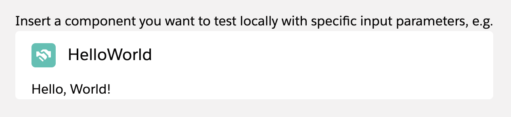

# Local Development Wrapper

A simple wrapper component to locally test input parameters of other components. How this works in detail is explained in the following Medium post: [Local Development for Lightning Web Components](https://medium.com/capgemini-salesforce-architects/local-development-for-lightning-web-components-7a3fdc1c4b7d)

