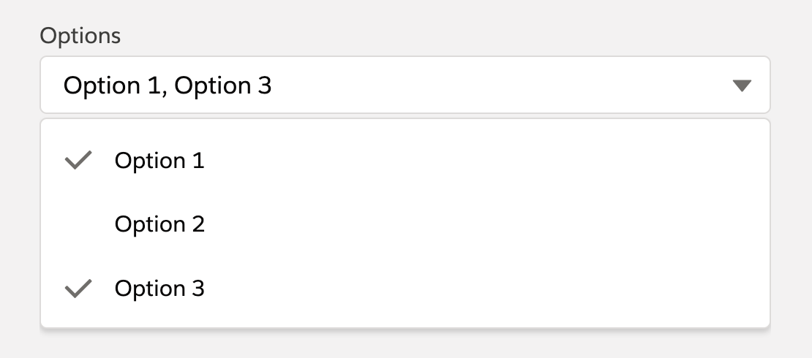

# Multi Select Combobox

Combobox with different configuration options that also supports multi select.

**Available in:** Not exposed in the Lightning App Builder - intended to be embedded in other components.



## Read on Medium

<a href="https://javascript.plainenglish.io/how-to-create-the-lwc-multi-select-combobox-that-salesforce-is-still-missing-c7bf3a2850dd">
  
</a>

**[How to Create the LWC Multi-Select Combobox that Salesforce is Still Missing](https://javascript.plainenglish.io/how-to-create-the-lwc-multi-select-combobox-that-salesforce-is-still-missing-c7bf3a2850dd)**

## Attributes

| Name          | Type    | Default            | Description                                                                                                    |
| ------------- | ------- | ------------------ | -------------------------------------------------------------------------------------------------------------- |
| disabled      | boolean | false              | If present, the combobox is disabled and users cannot interact with it.                                        |
| enable-search | boolean | false              | If present, a search input is shown inside the dropdown to filter options by label.                            |
| label         | string  | ''                 | Text label for the combobox.                                                                                   |
| name          | string  |                    | Specifies the name of the combobox.                                                                            |
| options       | Array   | []                 | A list of options that are available for selection. Each option has the following attributes: label and value. |
| placeholder   | string  | 'Select an Option' | Text that is displayed before an option is selected, to prompt the user to select an option.                   |
| read-only     | boolean | false              | If present, the combobox is read-only. A read-only combobox is also disabled.                                  |
| required      | boolean | false              | If present, a value must be selected before a form can be submitted.                                           |
| single-select | boolean | false              | If present, the combobox only allows the selection of a single value.                                          |
| show-pills    | boolean | false              | If present, the combobox will show a pill container with the currently selected options.                       |

## Usage

```html
<c-multi-select-combobox
  label="Products"
  name="products"
  options={options}
  onchange={handleChange}
  show-pills
  enable-search
></c-multi-select-combobox>
```

Each option requires a `label` and a `value`.

## Events

| Name   | Detail                                                                                 | Description                        |
| ------ | -------------------------------------------------------------------------------------- | ---------------------------------- |
| change | The selected options as an array, or a single option object if `single-select` is set. | Fired when the selection changes.  |
| close  | -                                                                                      | Fired when the dropdown is closed. |

## Component Dependencies

| Name                    | Type | Description                                                                              |
| ----------------------- | ---- | ---------------------------------------------------------------------------------------- |
| multiSelectComboboxItem | LWC  | Child component that represents an item within the multiSelectCombobox parent component. |
