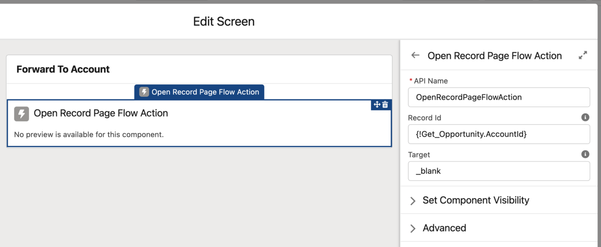

# Open Record Page Flow Action

Component to forward to a record page from flow.

## Attributes

| Name      | Type   | Default   | Description                                                      |
| --------- | ------ | --------- | ---------------------------------------------------------------- |
| record-id | string |           | Record Id of the record page to which the action should forward. |
| target    | string | '\_blank' | Open the page in the same '\_self' or in a new tab '\_blank '.   |
