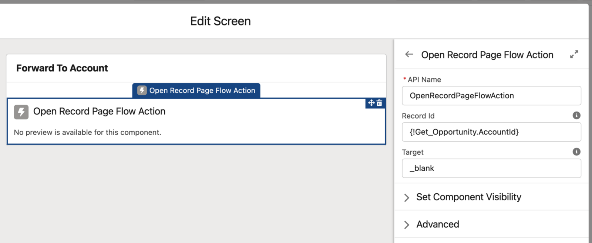

# Open Record Page Flow Action

Component to forward to a record page from flow.

**Available in:** Flow Screen



## Read on Medium

<a href="https://javascript.plainenglish.io/how-to-open-a-record-page-from-salesforce-flow-using-lwc-a8a94bc0c9ba">
  
</a>

**[How to open a Record Page from Salesforce Flow using LWC](https://javascript.plainenglish.io/how-to-open-a-record-page-from-salesforce-flow-using-lwc-a8a94bc0c9ba)**

## Attributes

| Name      | Type   | Default   | Description                                                      |
| --------- | ------ | --------- | ---------------------------------------------------------------- |
| record-id | string |           | Record Id of the record page to which the action should forward. |
| target    | string | '\_blank' | Open the page in the same '\_self' or in a new tab '\_blank '.   |

## Usage

```html
<c-open-record-page-flow-action record-id={recordId} target="_blank"></c-open-record-page-flow-action>
```

Add the component to a screen element in the Flow Builder and set the record-id input attribute to the Id of the target record. As soon as the screen is displayed, the component navigates to the record page - in the same tab ('\_self') or a new tab ('\_blank') depending on the target attribute.
