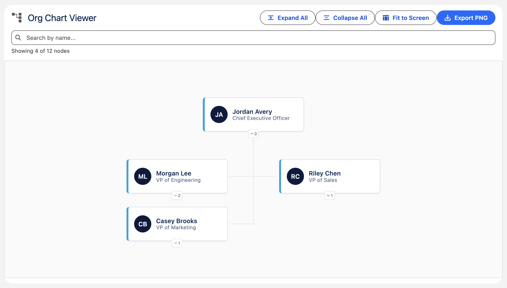

# Org Chart Viewer

An interactive organization chart with search, expand/collapse and PNG export, powered by the [d3-org-chart](https://github.com/bumbeishvili/org-chart) library. Ships with a small demo dataset so it works out of the box, or pass your own hierarchy via the `records` attribute.



## Attributes

| Name    | Type  | Default | Description                                                                                                                     |
| ------- | ----- | ------- | ------------------------------------------------------------------------------------------------------------------------------- |
| records | Array | []      | Flat list of records to render as a tree. Each record needs an id (or Id) and a parentId (or ManagerId), plus a name and title. |

## Usage

```html
<c-org-chart-viewer records="{employees}" onnodeselect="{handleNodeSelect}"></c-org-chart-viewer>
```

`onnodeselect` fires with `event.detail.record` whenever a node is clicked, so a parent component (or Flow) can react to the selection.

## Component Dependencies

| Name       | Type            | Description                                                                                   |
| ---------- | --------------- | --------------------------------------------------------------------------------------------- |
| d3orgchart | Static Resource | d3 v7 + d3-flextree + d3-org-chart - Libraries for rendering interactive organization charts. |
