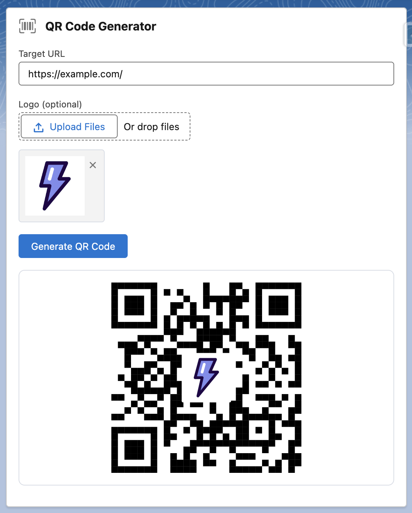

# QR Code Generator (QRCode.js)

A basic QR Code Generator with optional logo overlay using the external QRCode.js library.

## Component Dependencies

| Name     | Type            | Description                                                              |
| -------- | --------------- | ------------------------------------------------------------------------ |
| qrcodejs | Static Resource | QRCode.js - JavaScript Library for generating QRCodes with Logo Support. |
