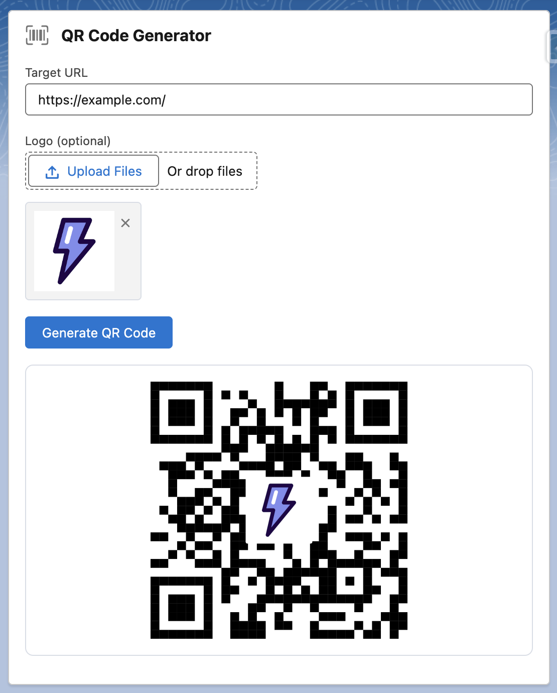

# QR Code Generator (QRCode.js)

A basic QR Code Generator with optional logo overlay using the external QRCode.js library. How the component was built and works in detail is explained in the following Medium post: [How to Generate QR Codes with Lightning Web Components](https://medium.com/capgemini-salesforce-architects/how-to-generate-qr-codes-with-lightning-web-components-4d41dd09f3c1)

## Component Dependencies

| Name     | Type            | Description                                                              |
| -------- | --------------- | ------------------------------------------------------------------------ |
| qrcodejs | Static Resource | QRCode.js - JavaScript Library for generating QRCodes with Logo Support. |
