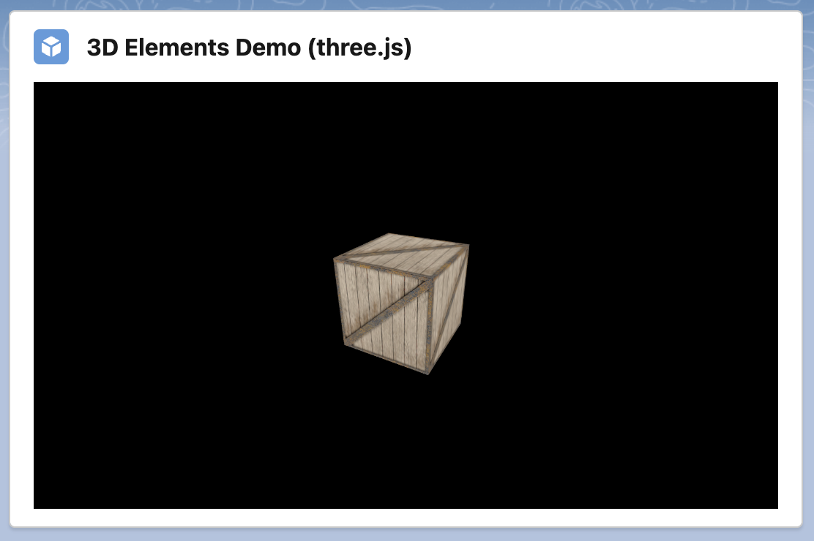

# Render 3D Elements (Three.js)

A simple demo component for rendering 3D elements using Three.js.

## Read on Medium

**[How to Render 3D Elements with Lightning Web Components](https://medium.com/capgemini-salesforce-architects/how-to-render-3d-elements-with-lightning-web-components-7f603129d5f0)**

## Component Dependencies

| Name    | Type            | Description                                                   |
| ------- | --------------- | ------------------------------------------------------------- |
| threejs | Static Resource | Three.js - Lightweight, cross-browser 3D library using WebGL. |
