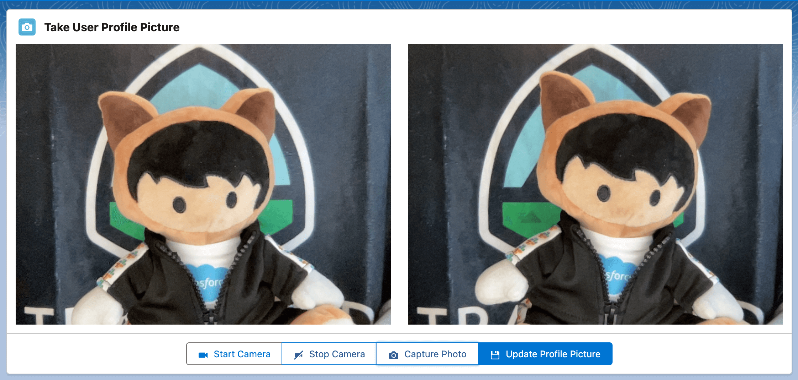
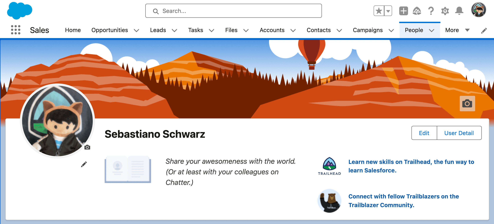

# Take User Profile Picture

A simple component that makes use of the Media Capture and Streams API to allow Salesforce users to take a new photo with their device's camera and use it to update their personal user profile. How the component was built and works in detail is explained in the following Medium post: [Allow your Salesforce Users to take a new Profile Picture](https://medium.com/gitconnected/allow-your-salesforce-users-to-take-a-new-profile-picture-201b45de9a6c)

## Component Dependencies

| Name                             | Type | Description                                               |
| -------------------------------- | ---- | --------------------------------------------------------- |
| UserProfilePictureController     | Apex | Controller class for updating the user's profile picture. |
| UserProfilePictureControllerTest | Apex | Test class for UserProfilePictureController.              |
