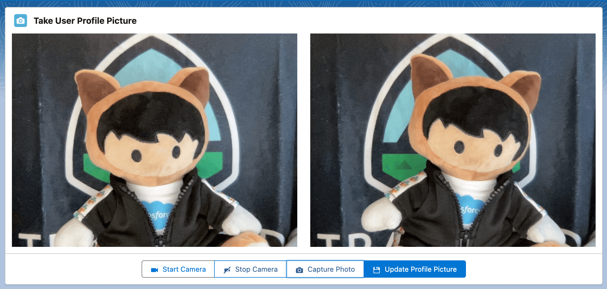
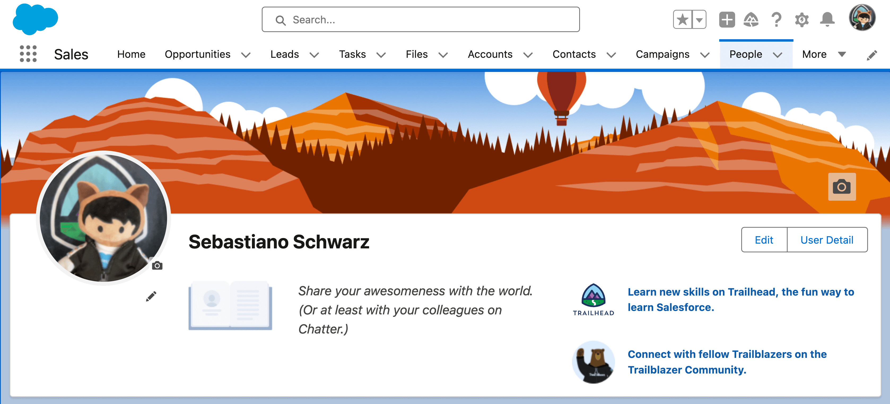

# Take User Profile Picture

A simple component that makes use of the Media Capture and Streams API to allow Salesforce users to take a new photo with their device's camera and use it to update their personal user profile.

**Available in:** App Page · Home Page · Record Page · Flow Screen





## Read on Medium

<a href="https://medium.com/gitconnected/allow-your-salesforce-users-to-take-a-new-profile-picture-201b45de9a6c">
  
</a>

**[Allow your Salesforce Users to take a new Profile Picture](https://medium.com/gitconnected/allow-your-salesforce-users-to-take-a-new-profile-picture-201b45de9a6c)**

## Usage

```html
<c-take-user-profile-picture></c-take-user-profile-picture>
```

The component is self-contained: it asks for camera access, takes a photo and updates the profile picture of the current user.

## Component Dependencies

| Name                             | Type | Description                                               |
| -------------------------------- | ---- | --------------------------------------------------------- |
| UserProfilePictureController     | Apex | Controller class for updating the user's profile picture. |
| UserProfilePictureControllerTest | Apex | Test class for UserProfilePictureController.              |
