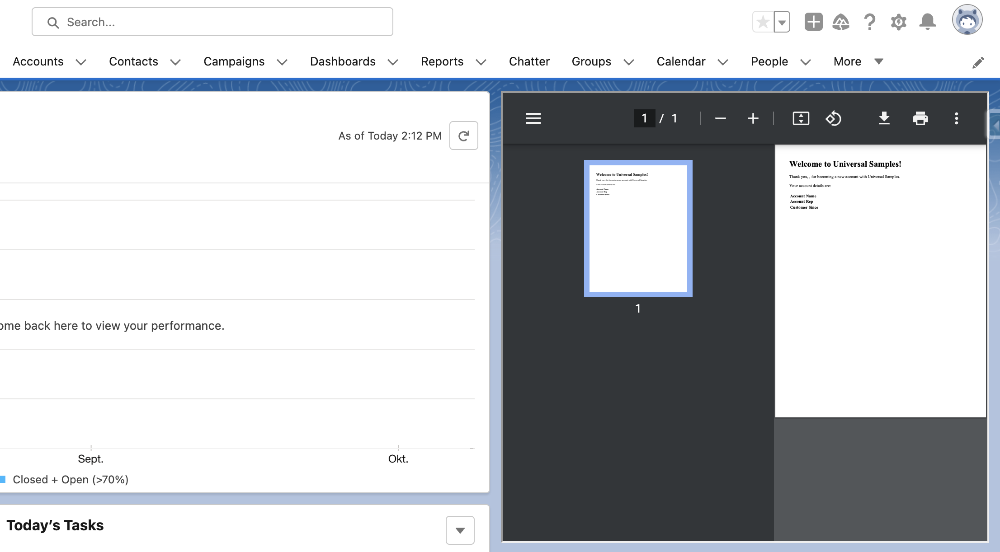

# Visualforce To PDF

A simple utility for displaying Visualforce based PDF documents.

**Available in:** App Page · Home Page · Record Page · Flow Screen



## Attributes

| Name   | Type   | Default | Description                                                             |
| ------ | ------ | ------- | ----------------------------------------------------------------------- |
| height | string | '500px' | Specifies the height of the PFD viewer. Default height is 500 pixels.   |
| url    | string | ''      | Specifies the Visualforce Page address of the document to be displayed. |
| width  | string | '100%'  | Specifies the width of the PFD viewer. Default width is 100 percent.    |

## Usage

```html
<c-visualforce-to-pdf url="/apex/AccountDetails" height="800px"></c-visualforce-to-pdf>
```

The url attribute takes the relative address of a Visualforce page that is rendered as PDF (`renderAs="pdf"`).
